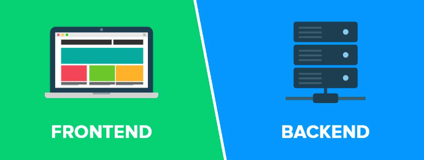

# K디지털 자바&Springboot 크로스 플랫폼(풀스택) 과정

## 📌 강사 이력

- 최주호 강사

- (현) 그린컴퓨터 강사
- (현) 경남정보대학교 클라우드학과 겸임교수
- (현) 겟인데어 대표 - 전자상거래, 미디어컨텐츠공급, 소프트웨어개발

- BNK 시스템 사원(실무)
- 경성대학교 정보전산원 사원(실무)
- 부산인재개발원 강사(강의)
- 부산IT교육센터 강사(강의)
- 코리아IT 강사(강의)
- 동의대학교 강사(강의)
- 고려제강(강의)
- 노마드랩 개발팀장(실무)

## 📌 특이사항

- 카카오 크러스트유니버스 NFT 플러터 앱개발
- Youtube 크리에이터 - 메타코딩 IT 채널 운영 (1만명)
- 메타코딩 IT 까페 운영 - (1천명)
- 한국공개SW협회 국방부 해커톤 대회 멘토 - 국방부장관상 수상
- (현) 구름에듀(온라인강의)
- (현) 패스트캠퍼스(온라인강의)
- (현) 인프런(온라인강의)
- (현) 이지업클래스(온라인강의)

### 유튜브 및 까페

<table>
    <tr>
    	<td></td>
        <td></td>
    </tr>
</table>

### 온라인컨텐츠 제작

<table>
    <tr>
    	<td></td>
    </tr>
    <tr>
		<td></td>
    </tr>
        <tr>
        <td></td>
    </tr>
</table>

## 📌 집필저서

| 도서명                                      | **저자                 | 출판   | 출판일  |
| ------------------------------------------- | ---------------------- | ------ | ------- |
| AWS 클라우드 CI/CD 배포                     | 최주호,정재원,정동진   | 앤써북 | 2023.02 |
| Flutter UI 실전                             | 김근호, 최주호, 황승준 | 앤써북 | 2021.08 |
| Flutter UI 입문                             | 최주호, 정호준, 정동진 | 앤써북 | 2021.07 |
| IoT 사물인터넷을 위한 라즈베리파이4 정석    | 최주호, 김재범, 정동진 | 앤써북 | 2019.11 |
| JSPStudy의 JSP & Servlet 웹 프로그래밍 입문 | 정동진, 최주호, 윤성훈 | 앤써북 | 2019.01 |
| JSPStudy의 Java 프로그래밍 입문             | 정동진, 김영진, 최주호 | 앤써북 | 2015.10 |

<table>
    <tr>
    	<td></td>
        <td></td>
        <td></td>
    </tr>
    <tr>
        <td></td>
    	<td></td>
        <td></td>
    </tr>
</table>

## 📌 훈련목표

> 백엔드 & 프론트앤드의 전 과정을 학습한다.
>
> 프로젝트 기획, 화면 설계, 데이터베이스 설계, 화면 구현, 기능 구현, 협업(형상관리) 및 커뮤니케이션을 직접 체험할 수 있다.
>
> 소프트웨어 개발이 완료되면 단위테스트, 통합테스트를 통해 프로젝트를 검증한다.
>
> 검증이 끝나면 해당 소프트웨어를 클라우드(AWS)에 배포하는 과정이다. 여기서 배포자동화 CI/CD를 배운다.

## 📌 단계별 학습

### 1단계

- 컴퓨터 사이언스 기초
- 자바 프로그래밍 언어
- SQL 데이터베이스 언어
- 자바스크립트 웹브라우저 언어

### 2단계

- [서버 개발] 스프링부트 웹서버 프레임워크 
- [보안] 스프링부트 웹서버 시큐리티 
- [Stateful 기반 서버] 서버사이드 렌더링 협업 프로젝트 진행

### 3단계

- [코드테스트] Junit 테스트
- [코드관리] Git 버전관리를 통해 팀원과의 협업 기술 배우기
- [Devops] AWS 클라우드 CI/CD 배포 운영 관리
- [Stateless 기반 서버] 클라이언트 사이드 렌더링 협업 프로젝트 진행

### 4단계

- [Stateless 기반 서버] 스프링부트 JWT RestAPI 구축
- [앱개발] Flutter 앱 프로그래밍
- 파이널 프로젝트를 통해 백엔드와 프로튼앤드 협업 프로젝트를 진행

## 📌 차별화된 최신 기술 교육

<table>
    <tr>
    	<td></td>
        <td>소프트웨어를 테스트하는 방법을 배운다</td>
    </tr>
</table>

<table>
    <tr>
    	<td></td>
        <td>OAuth2.0 서버를 만드는 방법을 배운다 (카카오,네이버 로그인 같은 것)</td>
    </tr>
</table>

<table>
    <tr>
    	<td></td>
        <td>팀원과 협업하는 방법에 대해서 배운다 - 재택 근무를 가능하게 해주는 기술</td>
    </tr>
</table>

<table>
    <tr>
    	<td></td>
        <td>서버, 네트워크 관리자 없이 클라우드의 Iaas, Paas 기술을 사용하여 서버를 운영 및 관리하고 배포하는 방법을 배운다</td>
    </tr>
</table>

<table>
    <tr>
    	<td></td>
        <td>구글의 Flutter 기술을 배운다. IOS 앱과, Android 앱, 그리고 브라우저 웹, 데스크탑 앱을 하나의 언어로 한번에 개발할 수 있게 해주는 트렌디한 기술이다</td>
    </tr>
</table>

## 📌 프로젝트 3단계

> 🪂 휴먼 클라우드 이력 관리 플랫폼 웹 개발

<table>
    <tr>
    	<td></td>
    </tr>
</table>

> 🪂 휴먼 클라우드 이력 관리 플랫폼 RestAPI 서버 구축

<table>
    <tr>
    	<td></td>
    </tr>
    <tr>
    	<td></td>
    </tr>    
</table>

> 🪂 중계플랫폼 웹/앱 개발

<table>
    <tr>
    	<td></td>
    </tr>
    <tr>
    	<td></td>
    </tr>
    <tr>
    	<td></td>
    </tr>
    <tr>
    	<td></td>
    </tr>
</table>

