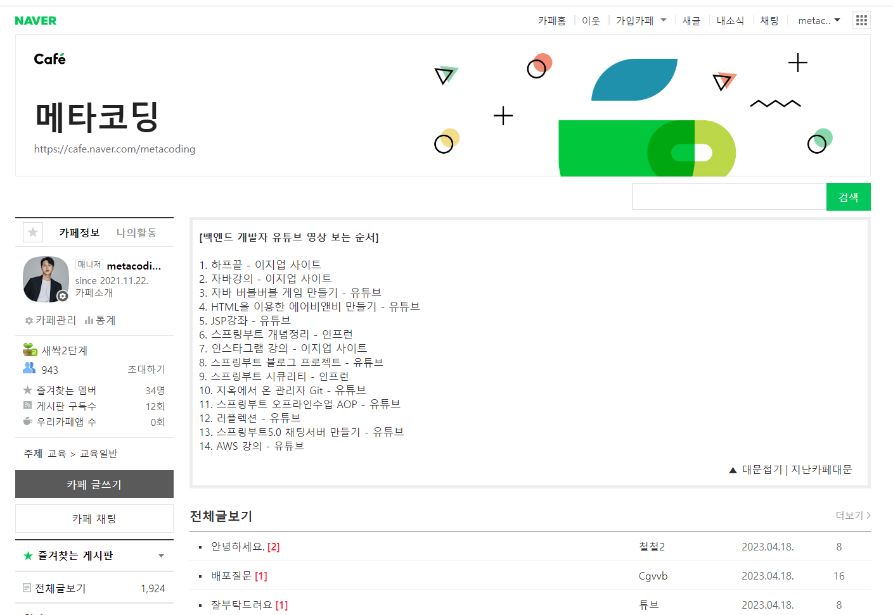

## 📌 강사 이력

- 최주호 강사

- (현) 경남정보대학교 클라우드학과 겸임교수
- (현) 겟인데어 대표 - 전자상거래, 미디어컨텐츠공급, 소프트웨어개발

- BNK 시스템 사원(실무)
- 경성대학교 정보전산원 사원(실무)
- 부산인재개발원 강사(강의)
- 부산IT교육센터 강사(강의)
- 코리아IT 강사(강의)
- 동의대학교 강사(강의)
- 고려제강(강의)
- 그린컴퓨터(강의)
- 노마드랩 개발팀장(실무)

## 📌 특이사항

- 카카오 크러스트유니버스 NFT 플러터 앱개발
- 한국전력 Flutter 앱 개발
- Youtube 크리에이터 - 메타코딩 IT 채널 운영 (1만명)
- 메타코딩 IT 까페 운영 - (1천명)
- 한국공개SW협회 국방부 해커톤 대회 멘토 - 국방부장관상 수상
- (현) 구름에듀(온라인강의)
- (현) 패스트캠퍼스(온라인강의)
- (현) 인프런(온라인강의)
- (현) 이지업클래스(온라인강의)

### 유튜브 및 까페

<table>
    <tr>
    	<td></td>
        <td></td>
    </tr>
</table>

### 온라인컨텐츠 제작

<table>
    <tr>
    	<td></td>
    </tr>
    <tr>
		<td></td>
    </tr>
        <tr>
        <td></td>
    </tr>
</table>

## 📌 집필저서

| 도서명                                      | **저자                 | 출판   | 출판일  |
| ------------------------------------------- | ---------------------- | ------ | ------- |
| AWS 클라우드 CI/CD 배포                     | 최주호,정재원,정동진   | 앤써북 | 2023.02 |
| Flutter UI 실전                             | 김근호, 최주호, 황승준 | 앤써북 | 2021.08 |
| Flutter UI 입문                             | 최주호, 정호준, 정동진 | 앤써북 | 2021.07 |
| IoT 사물인터넷을 위한 라즈베리파이4 정석    | 최주호, 김재범, 정동진 | 앤써북 | 2019.11 |
| JSPStudy의 JSP & Servlet 웹 프로그래밍 입문 | 정동진, 최주호, 윤성훈 | 앤써북 | 2019.01 |
| JSPStudy의 Java 프로그래밍 입문             | 정동진, 김영진, 최주호 | 앤써북 | 2015.10 |

<table>
    <tr>
    	<td></td>
        <td></td>
        <td></td>
    </tr>
    <tr>
        <td></td>
    	<td></td>
        <td></td>
    </tr>
</table>

